# RAG Service

A fully local, production-grade Retrieval-Augmented Generation service. Drop in a folder of documents, ask questions, get cited answers. Runs entirely on your machine — no cloud required, though cloud LLMs are supported as a fallback.

---

## Architecture

The system has three independent flows: ingestion, query, and evaluation. The diagram below covers all three.

> **Interactive diagram:** [`rag_flow.mermaid`](./rag_flow.mermaid) — paste the contents into [mermaid.live](https://mermaid.live) to view it.

```mermaid
flowchart LR
    subgraph INGEST["📥 INGEST FLOW"]
        direction TB
        A["📁 Folder of .pdf / .md / .txt"]
        B["LoaderFactory\n─────────────\nPDF → page by page\nMD  → extract headings\nTXT → raw read"]
        C["Chunker\n─────────────\nRecursiveCharacterSplitter\n1200 chars / 200 overlap\nstable SHA256 chunk_id"]
        D["Embedder\n─────────────\nnomic-embed-text via Ollama\nbatches of 32 → 768D vectors"]
        E[("ChromaDB\nupsert · idempotent")]
        F["BM25 index\nrebuilt in memory"]

        A --> B --> C --> D --> E
        E -.-> F
    end

    subgraph QUERY["🔍 QUERY FLOW"]
        direction TB
        G["User Question"]
        H{{"Redis Cache"}}
        HIT["Return cached response"]
        I["Embed question → 768D vector"]

        subgraph HYBRID["Hybrid Retrieval"]
            J["Vector search\ncosine · top 10"]
            K["BM25 search\nkeyword · top 10"]
            L["Fuse scores\n0.7 × vector + 0.3 × BM25"]
            M["Cross-encoder rerank\n→ top 4 chunks"]
            J & K --> L --> M
        end

        N["Build Prompt\n─────────────\nsystem: only use context, cite chunk IDs\nuser: chunks + question"]
        O["LLM Generate Answer\nllama3.2 / Claude / Gemini"]

        subgraph VERIFY["✅ Verification Pass"]
            P{{"Is answer fully\nsupported by context?"}}
            YES["Return answer + citations"]
            NO["Return INSUFFICIENT_CONTEXT\n🚫 no hallucination passes through"]
            P -- YES --> YES
            P -- NO  --> NO
        end

        Q[("Redis cache\nTTL 3600s")]
        R["QueryResponse\n{ answer, citations, from_cache }"]

        G --> H
        H -- HIT --> HIT
        H -- MISS --> I --> HYBRID --> N --> O --> VERIFY
        YES --> Q --> R
    end

    subgraph EVAL["📊 EVALUATION FLOW"]
        direction TB
        S["eval_dataset.json\n{ id, type, question,\n  ground_truth_answer,\n  ground_truth_context }"]
        T["For each question\nPOST /query"]
        U["chunk_texts = citation.text"]

        subgraph METRICS["5 Metrics"]
            M1["Context Precision"]
            M2["Context Recall"]
            M3["Faithfulness"]
            M4["Answer Relevancy"]
            M5["Answer Correctness"]
        end

        V["Aggregate scores per question"]
        W["Failure analysis\nflag any metric < 0.5"]
        X["generate_report()\n→ eval_report.md"]

        S --> T --> U --> METRICS --> V --> W --> X
    end

    style INGEST fill:#1e3a5f,color:#fff,stroke:#4a90d9
    style QUERY  fill:#1e3a2f,color:#fff,stroke:#4ad98a
    style EVAL   fill:#3a1e2f,color:#fff,stroke:#d94a90
    style HYBRID fill:#0d2a1a,color:#fff,stroke:#2a8a5a
    style VERIFY fill:#2a1a0d,color:#fff,stroke:#8a5a2a
    style METRICS fill:#2a0d1a,color:#fff,stroke:#8a2a5a
```



---

## Prerequisites

- Docker and Docker Compose installed
- Internet access (first run pulls models)
- **16 GB RAM** minimum
- **4+ CPU cores**
- **~20 GB free disk space** (Ollama models + vector DB)
- No GPU required — CPU inference is fine, just slower

---

## Setup & Run

**1. Clone the repo and enter the directory**

```bash
git clone <repo-url>
cd rag-service
```

**2. (Optional) Set up your `.env` file**

If you want to use a cloud LLM instead of the local Ollama model, add your key:

```bash
# .env
ANTHROPIC_API_KEY=sk-ant-...   # uses Claude — ~40x faster on M2 Air
# or
GEMINI_API_KEY=...             # uses Gemini
```

If neither key is present, the service defaults to `llama3.2` running locally via Ollama.

**3. Start all services**

```bash
docker compose up --build
```

On first run this pulls `llama3.2` and `nomic-embed-text` from Ollama (~5–8 GB). Subsequent starts are fast. The API is ready when `GET /health` returns `"status": "ok"`.

**4. Ingest your documents**

```bash
curl -X POST http://localhost:8080/ingest \
  -H "Content-Type: application/json" \
  -d '{"path": "/app/data/your-docs"}'
```

Supported formats: `.pdf`, `.md`, `.txt`. The call is idempotent — safe to run again after adding or updating files.

**5. Ask a question**

```bash
curl -X POST http://localhost:8080/query \
  -H "Content-Type: application/json" \
  -d '{"question": "What is the recommended format for Claude prompts?"}'
```

Response includes the answer, inline chunk citations, and a `from_cache` flag.

**6. Use the UI**

Open [http://localhost:8080](http://localhost:8080) in your browser for a minimal chat interface.

### Other useful endpoints

| Endpoint | Method | Purpose |
|---|---|---|
| `/health` | GET | Check status of all components |
| `/query` | POST | Ask a question (`stream: true` for SSE) |
| `/ingest` | POST | Ingest a folder of documents |
| `/research` | POST | Agentic deep-dive on a topic |
| `/config/chunking` | GET / POST | Inspect or update chunking config live |

---

## Design Decisions & Tradeoffs

### Chunking

Documents are split using recursive character splitting — 1200 chars per chunk, 200 overlap. The separator priority is markdown-aware: it tries to break on headings first (`## `, `### `), then paragraphs, then sentences, then words. This works well for prose and structured docs.

The tradeoff is that it's content-blind. Tables, code fences, and JSON get the same treatment as plain text and often split mid-structure. Chunk IDs are `SHA256(path + index)`, which makes re-ingestion idempotent but means editing one paragraph at the top of a file forces re-embedding of every chunk below it.

### Models

- **Embeddings:** `nomic-embed-text` via local Ollama (768D). Fully offline, no API cost. Lower quality than `text-embedding-3-large` or `bge-m3`, but sufficient for technical documentation.
- **LLM:** `llama3.2` locally by default. Cloud fallbacks are auto-detected from environment variables — Anthropic first, then Gemini. Temperature is 0.1 to keep answers factual, though this makes the model conservative during synthesis tasks.
- **Reranker:** `ms-marco-MiniLM-L-6-v2` cross-encoder. Fast on CPU. The downside is it was trained on web search queries, not technical documentation, so relevance scores can be off for dense reference content.

### Retrieval

Two-stage pipeline: vector search and BM25 run in parallel, scores are fused at 70/30 (vector/BM25), then a cross-encoder reranks the top 10 down to top 4. The hybrid approach is deliberate — pure semantic search misses exact-match queries like error codes and API parameter names, and BM25 fills that gap.

The 70/30 split is hardcoded. For heavy keyword-based corpora it should probably be closer to 50/50.

### Verification pass

After the LLM generates an answer, a second LLM call checks whether every claim in the answer is actually supported by the retrieved chunks. If not, the answer is replaced with `INSUFFICIENT_CONTEXT`. This is the main guard against the model answering from its training data instead of the documents.

### Caching

Redis, keyed by MD5 of the normalized question. Cache hits skip embedding, retrieval, and generation entirely. The limitation is exact-string matching only — paraphrased questions always miss. Cache also does not invalidate on re-ingest, so stale answers can survive up to the TTL (default: 1 hour).

---

## Known Limitations

- **BM25 is not persisted.** If the API restarts, the BM25 index is empty until the next ingest call. During that window, hybrid search silently degrades to vector-only with no warning.
- **Full BM25 rebuild on every ingest.** Scans all of ChromaDB each time. Gets slow as the corpus grows.
- **No document deletion.** You can re-ingest updated files, but there's no way to remove a document without wiping the entire collection.
- **Cache doesn't invalidate on re-ingest.** Updated documents won't be reflected in answers until the Redis TTL expires.
- **Fixed rerank depth.** Every query retrieves top 4 chunks after reranking. Simple questions need 1; complex research questions need more. There's no adaptive scaling.
- **Single collection for all documents.** No namespace isolation — ingesting unrelated document sets pollutes retrieval across all queries.
- **Agent gap detection is string matching.** The research endpoint detects when a sub-question couldn't be answered by checking for phrases like "I don't have enough information." LLM phrasing varies and this heuristic is fragile.
- **No auth or rate limiting** on any endpoint.

---

## What I'd Improve With More Time

**Quick wins**

- Persist BM25 to Redis or disk and restore on startup — eliminates the cold-start degradation window
- Invalidate relevant cache keys on re-ingest rather than relying on TTL
- Semantic cache — embed the query and return a hit when cosine similarity > 0.95, not just on exact string match
- Add `DELETE /documents/{source}` to remove documents from ChromaDB without wiping everything

**Bigger lifts**

- **Document-aware chunking** — detect tables, code blocks, and lists before splitting and treat them as atomic units. This is the single highest-leverage retrieval improvement.
- **Content-hash chunk IDs** — base the ID on the chunk text content rather than its position in the file. Unchanged paragraphs would survive document edits without re-embedding.
- **Adaptive rerank depth** — scale `rerank_top_k` based on query complexity rather than hardcoding 4.
- **Tenant namespacing** — accept a `collection_id` on ingest and query so multiple knowledge bases can coexist without cross-contamination.
- **Eval in CI** — run the evaluation pipeline against a fixed test corpus on every deploy and gate on minimum metric thresholds (e.g., faithfulness ≥ 0.85).

---

## Issues Encountered

The main challenge was the model's tendency to answer from its own training data rather than the retrieved documents. The corpus is Anthropic documentation, which `llama3.2` has likely seen during training — so when retrieval returned wrong chunks, the model still produced confident-sounding answers instead of refusing.

Mitigations applied: rebuilt the system prompt to emphasize context-only answering, set temperature to 0.1, and added a post-generation verification pass that rejects answers not grounded in retrieved chunks. Switching to a more instruction-following model (e.g., Claude Haiku) would likely reduce this problem further.
